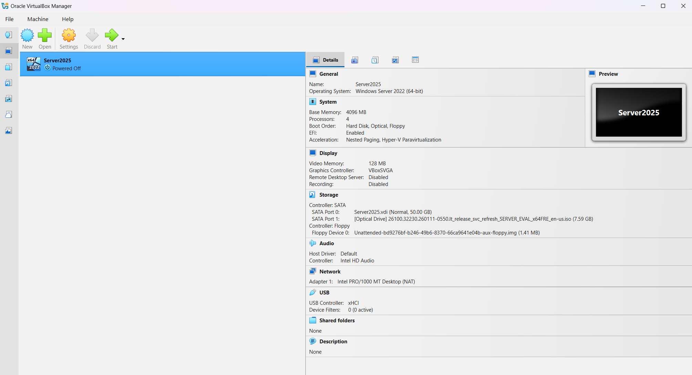

# Building VM's with type 2 hypervisor  


## Front page 

- Author
  - Roberto D'Arro (rd222kd@student.lnu.se)
  - Mussie Shifera Assefa (ms228qx@student.lnu.se)

- Submission date 
  - 09/28/2026

- Host OS
  - window 11 version 25H2

- Type 2 hypervisor
  - virtualbox (7.2.2r170484) (where 170484 is the specific build number)


## Part A — the machine 


### Tasks A1 (Install a type 2 hypervisor)

The chosen host machine under the hybervisor is Windows 11 version 25H2 and Oracle virtualbox as a type 2 hypervisor. 

Oracle VM VirtualBox is a free, open-source virtualization software that runs on Windows 11 to let you create and run other operating systems—like Linux, macOS, or older Windows versions—as virtual machines right on your desktop.



Alongside installing the hypervisor recommended to install the extension package this is usefull i.e NIC (network card interface) ability fot the guest machine.   

### Tasks A2 ( Create the machine)

The standard procedure for creating a new Virtual Machine (VM) within Oracle VM VirtualBox. This process allows an administrator to isolate and run a secondary guest operating system safely inside a host computer's existing environment.

**Technical Methodology**

The setup process involves configuring virtual hardware resources to mimic a physical computer through a five-step wizard:

  - Instance Initialization: Initiating the wizard via the New button to define the machine's name, host destination folder, and the guest operating system's ISO image.

  

  - Hardware Allocation: Adjusting the allocation sliders to assign host RAM and CPU cores to the virtual environment based on guest OS system requirements.

  

  - Virtual Disk Provisioning: Setting up a virtual hard disk using the Dynamically allocated format, ensuring host storage is only consumed as data is written within the VM.

  

  - Configuration Validation: Reviewing the hardware summary matrix before clicking Finish to build the virtual machine.

  

**Operational Benefits**

  - Resource Efficiency: Dynamic disk provisioning prevents immediate storage depletion on the host machine.

  - Environment Isolation: The guest OS operates inside a sandboxed layer, protecting the host system from potential malware or software instability.


### Tasks A3 (inspect the four resources)


> 1. lscpu | grep -i hypervisor

- What the guest sees:

The guest sees a hypervisor vendor: KVM. It recognizes that its CPU execution is being managed by a virtualization layer.

- What it really is:

The guest is interacting with a virtualized CPU topology. The hypervisor intercepts specific CPU instructions (using hardware extensions Intel VT-x) and presents a simulated or pass-through subset of the physical host’s CPU capabilities to the guest.


> 2. free -h

- What the guest sees:

The guest sees a rigid, fixed amount of total, used, and available random-access memory (i.e Total: 1.9GiB). It acts as if it has exclusive, physical ownership of this address space.

- What it really is:

This memory is a slice of the host's physical RAM, mapped to the guest's virtual address space by the hypervisor. 

In reality, the host may use techniques like

  - memory ballooning, 

  - page sharing, or overcommitting, meaning the physical RAM backing the guest can dynamically shift or be shared with other VMs.


> 3. lsblk

- What the guest sees:

The guest sees emulated SCSI/SATA drives (i.e sda and partion sda1 and sda2). It treats these as local, physical hardware drives.

- What it really is:

The sda disk is not a physical hard drive. It is a virtual disk file (most likely a .vdi or .vmdk file) stored on the host computer's actual drive. It is configured inside VirtualBox as a virtual SATA or SCSI controller storage device.

The sr0 drive is an ISO image file (such as a Linux installation disc or VirtualBox Guest Additions) mapped by the VirtualBox hypervisor to act like a physical disc inserted into a tray.


> 4. ip addr

- What the guest sees:

The guest sees local network interfaces (such as eth0, ens3, or enp0s3) assigned specific IP addresses, usually within a private subnet. It perceives these as dedicated network interface cards connected to a physical switch.

- What it really is:

The guest is using a Virtual Network Interface Card (vNIC) software-emulated by the hypervisor. This vNIC connects to a virtual bridge or switch inside the host's operating system, which multiplexes the traffic alongside other VMs over the host's actual physical network interface card (pNIC).


> 5. systemd-detect-virt

- What the guest sees:

oracle: The guest operating system explicitly detects that it is running in an environment managed by Oracle. The system detects specific firmware parameters, DMI/SMBIOS motherboard strings, and hypervisor CPUID flags that identity the virtual hardware layer.

- What it really is:

Oracle VM VirtualBox: The hypervisor software running on the host machine is VirtualBox. When the virtual machine boots up, VirtualBox populates the guest's virtual BIOS/EFI system tables with identifying metadata (such as the system manufacturer string).

Detection Mechanism: The systemd-detect-virt command looks inside files like /sys/class/dmi/id/product_name and detect execution in a virtualized environment.


## Part B — allocation 


### Tasks B1 (Measure the vCPU count)


### Tasks B2 (Produce contention)


### Tasks B3 (Your consolidation ratio)


## Reflection 

What virtualization buys and what it costs — half 


## Appendix

Part A task 3:

```bash

sudo cat /proc/meminfo | grep MemTotal

sudo cat /sys/class/dmi/id/product_name

```

